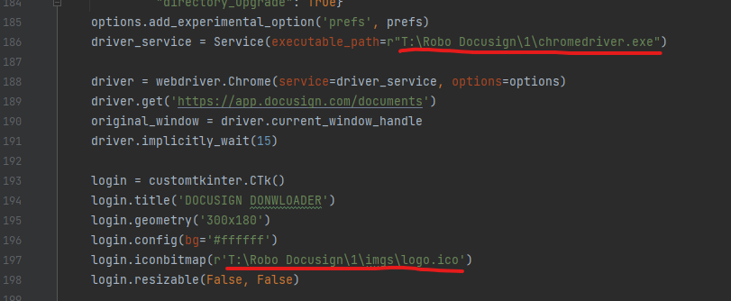

# auto-download-docusign

	

		
	

	<h2 class="f4 my-3">
		Descripction
	</h2>
	

		The Docusign website don't let us downloaded multiple documents, so I made this App to solve this problem. It downloaded automatically all documents in a page using Selenium.
	

	<h2 class="f4 my-3">
		How to use?
	</h2>
	

		You can use this App by downloading the files and running main.py in an IDE that supports Python.
    Don't forget that you need to have Python installed on your computer.
    Before trying to run, make sure you have the chromedriver downloaded on your machine and that the path is specified on row 186. Also specify a path to an icon on row 197, with the .ico extension.
		
	

	<h3>
		Step by step
	</h3>
	

		When you run this code, a Windows Explorer window will appear, where you will have to select the path where the downloads will go.
	Then a page will open for you to log into docusign, after logging in, select the folder that has the documents you want to download and click on the "Download all documents" button.
	

